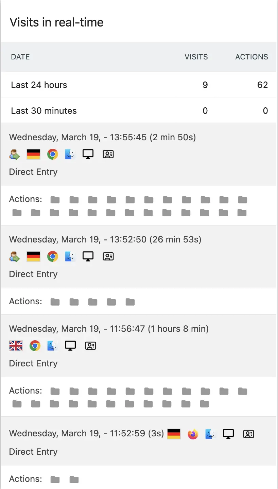

# We Want Them Back

## Table of Contents

1. [Introduction](#introduction)
   - Project background and mission

2. [Overview](#overview)
   - Technical stack and platform features

3. [Project Structure](#project-structure)
   - Route organization
   - Component hierarchy
   - Dynamic routing

4. [Data Management with Grist](#data-management-with-grist)
   - Database structure and integration

5. [Interactive Visualizations](#interactive-visualizations)
   - Leaflet Map Integration
   - D3.js Circle Packing

6. [Content Management with Kirby CMS](#content-management-with-kirby-cms)
   - Dynamic content and section management

7. [Image Optimization](#image-optimization)
   - Next.js Image component
   - Sharp integration
   - Performance benefits

8. [Analytics](#matomo-analytics-integration)
   - Matomo implementation
   - Privacy measures
   - User tracking

9. [Deployment & CI/CD](#deployment)
   - Docker configuration
   - Server infrastructure
   - GitHub Actions workflows
   - Automated data synchronization

10. [Getting Started](#getting-started)
   - Setup and installation guide

11. [License](#license)
    - Terms of use
    - Documentation license
    - Third-party licenses

12. [Deployment](#deployment)
    - Deployment process and infrastructure


&nbsp;
# Introduction

It was at a We Want Them Back symposium in spring 2022 that Santi Hitorangi from Repat. A-Take came up with the idea of developing an app based on the publication We Want Them Back. Together, we set out to develop this web-based application as an interactive tool to provide transparent information about ancestral remains from colonial contexts in Germany and particularly to help descendants find their ancestors and bring them back home. We hope that this tool will be helpful to anyone trying to facilitate repatriation. It therefore includes information on which institutions still have control over ancestral remains that may be associated with particular societies.
As a dynamic, living application, it allows people to share their stories, put a face to the ancestors and add information. It aims to provide practical tools for contacting museums and facilitating repatriation processes - especially as we continue to fight for a rights-based, legal solution to ancestral repatriation and the restitution of cultural entities from colonial contexts in Germany.
At the same time, the app shows the (lack of) progress made by the individual institutions in repatriating the ancestors. It shows the extent to which museums, universities and other institutions have failed to return ancestors


&nbsp;
# Overview

The platform modern technology:
- **Grist Integration**: For robust data management and real-time updates
- **Leaflet Mapping**: For interactive geographical visualization
- **User Interface**: Designed for accessibility and ease of use

### Technical Stack
- **Frontend**: Next.js, React
- **Data Management**: Grist
- **Visualization**: D3.js, Leaflet
- **Styling**: TailwindCSS
- **Monitoring**: Matomo


&nbsp;
# Project Structure
Our Next.js application follows a structured organization for routes and components:
```bash
/src/
├── pages/                      # Next.js pages directory
│   ├── _app.js                # Global app configuration, Matomo analytics setup
│   ├── index.js               # Home page
│   ├── 404.js                 # Custom 404 error page
│   ├── 500.js                 # Custom 500 error page
│   │
│   ├── search/                # Search functionality routes
│   │   ├── institution/       # Institution search
│   │   │ └── [slug].js        # Dynamic institution page
│   │   └── origin/           # Origin-based search routes
│   │       ├── ancestry/      # Ancestry-specific searches
│   │       │   └── [slug].js  # Dynamic ancestry pages
│   │       ├── continent/     # Continent-specific searches
│   │       │   └── [slug].js  # Dynamic continent pages
│   │       ├── country/       # Country-specific searches
│   │       │   └── [slug].js  # Dynamic country pages
│   │       └── region/        # Region-specific searches
│   │           └── [slug].js  # Dynamic region pages
│   │
│   └── stories/              # Stories section
│       └── [slug].js         # Dynamic story pages
```
### Route Structure Overview

#### Main Pages
- `/` - Home page
- `/404` - Custom Not Found page
- `/500` - Server Error page

#### Search Routes
- `/search/institution/*` - Institution-based searches
- `/search/origin/` - Origin-based searches with subcategories:
  - `ancestry/[slug]` - Search by ancestry
  - `continent/[slug]` - Search by continent
  - `country/[slug]` - Search by country
  - `region/[slug]` - Search by region

#### Content Routes
- `/stories/[slug]` - Individual story pages

### Dynamic Routes
All `[slug].js` files represent dynamic routes that:
- Accept URL parameters
- Generate dynamic content based on the slug
- Handle data fetching for specific entities

### Page Components
Each route is associated with a page component that:
- Handles data fetching
- Manages state
- Renders appropriate UI components
- Implements error handling

This structure enables:
- Clear navigation hierarchy
- Efficient routing
- Scalable content management
- SEO-friendly URLs


&nbsp;
# Data Management with Grist

Our application implements a comprehensive data management system using Grist, structured to handle various types of data related to ancestral remains and institutions.

### Data Structure Overview
- **Human Remains Data**
  - Individual records tracking
  - Summary statistics
  - Repatriation status

- **Institution Data**
  - Basic information (name, location, contact details)
  - Current holdings count
  - Repatriation progress
  - Detailed microscope view of collections

- **Geographical Data**
  - Ancestry tracking
  - Continental classification
  - Country-level information
  - Regional details

### Data Fetching Architecture
```javascript
// Example of our data fetching structure
const fetchAndCacheGrist = async ({ routeId, filePath }) => {
  // Fetch data from Grist
  // Cache results locally
  // Transform data as needed
  // Return structured data
};
```

### Key Features
- **Automated Data Caching**
  - Local storage of fetched data
  - Optimized performance
  - Reduced API calls

- **Data Transformation**
  - Standardized data formatting
  - Field mapping for consistency
  - Reference data generation

- **Flexible Querying**
  - Filter by various parameters
  - Geographic data correlation
  - Institution-specific views

### Available Data Endpoints
- Database status and updates
- Human remains records
- Institution profiles
- Geographic classifications
- Statistical summaries

This integration ensures efficient data management and accessibility while maintaining data integrity and performance.


&nbsp;
# Interactive Visualizations

## 1. Leaflet Map Integration

Our application implements an interactive mapping system using React-Leaflet to visualize institutional locations and ancestral remains data.

### Custom Marker Styling with RoughJS

Our application implements custom map markers using RoughJS to create a unique, hand-drawn aesthetic that matches our design language.

#### Implementation Overview

1. **Custom Icon Creation**
```javascript
const createRoughMarker = ({ canvasSize, radius, clicked }) => {
  // Setup Canvas with Device Pixel Ratio
  const dpr = window.devicePixelRatio || 1;
  const canvas = document.createElement("canvas");
  canvas.width = canvasSize * 2 * dpr;
  canvas.height = canvasSize * 2 * dpr;

  // Setup Canvas Context
  const ctx = canvas.getContext("2d");
  ctx.scale(dpr, dpr);

  // Create RoughJS Drawing
  const roughCanvas = rough.canvas(canvas);
  roughCanvas.circle(canvasSize, canvasSize, radius * 2, {
    stroke: "none",
    strokeWidth: 1,
    fillWeight: 1,
    fill: clicked ? COLORS.active : COLORS.default,
  });

  // Convert to Leaflet Icon
  return L.icon({
    iconUrl: canvas.toDataURL(),
    iconSize: [radius * 2, radius * 2],
    iconAnchor: [radius, radius],
    popupAnchor: [0, -radius],
  });
};
```

2. **Marker Implementation**
```javascript
import { Marker } from 'react-leaflet';

const CustomMarker = ({ position, isSelected }) => {
  const markerIcon = useGetIconUrl({
    value: markerValue,
    clicked: isSelected,
    // ... other options
  });

  return (
    <Marker
      position={position}
      icon={markerIcon}
      zIndexOffset={isSelected ? 1000 : 0}
    >
      {/* Popup content */}
    </Marker>
  );
};
```

### Map styling
#### Implementation
```javascript
<TileLayer
  attribution='&copy; <a href="https://www.openstreetmap.org/copyright">OpenStreetMap</a>'
  url={`${MapBox_URL_TOKEN}`}
/>
```

### Map Center Calculation and Bounds

This feature automatically centers the map view to show all markers within the optimal viewport.

#### Implementation
```javascript
const calculateMapBounds = (data) => {
  // Extract all latitude/longitude pairs
  const allLatLng = data.map(value => [
    value.institution.latitude,
    value.institution.longitude
  ]);

  // Create a feature group for markers
  const markerGroup = L.featureGroup();
  
  // Add all markers to the group
  allLatLng.forEach(coords => {
    const marker = L.marker(coords);
    markerGroup.addLayer(marker);
  });

  // Get bounds of all markers
  const bounds = markerGroup.getBounds();
  
  // Animate map to show all markers
  map.flyToBounds(bounds, {
    duration: 14,    // Animation duration in seconds
    padding: [50, 50] // Optional padding around bounds
  });
};
```


### Map Features
- **Interactive Markers**
  - Dynamic marker sizing based on remains count
  - Custom icons for different states (selected/unselected)
  - Popup information windows
  - Automatic bounds fitting for marker groups

- **Responsive Design**
  - Mobile-optimized interface
  - Desktop-specific controls
  - Adaptive layout and controls positioning


### Interactive Features
- **Marker Interaction**
  - Click events for detailed information
  - Institution navigation
  - Dynamic marker highlighting
  - Automatic map centering on selection

- **Information Display**
  - Institution name
  - Current holdings count
  - Total remains count
  - Direct navigation links


### User Interaction
- **Navigation**
  - Click-to-center functionality
  - Zoom controls
  - Marker selection
  - Institution detail access

- **Data Visualization**
  - Proportional marker sizing
  - Visual feedback on interaction
  - Clear information hierarchy
  - Intuitive navigation patterns

This mapping system provides an intuitive interface for exploring institutional locations and their associated data, while maintaining responsiveness across different devices and screen sizes.

## 2. Circle Packing Implementation with D3.js and RoughJS

Our Circle Packing visualization combines D3.js hierarchical layouts with RoughJS styling to create an interactive, hand-drawn aesthetic visualization of ancestral remains data.

### Core Implementation

#### 1. Basic Setup
```javascript
const CirclePackingContainer = ({ data, kirbyData, data2 }) => {
  const svgContainerRef = useRef(null);
  const [getForceReset, setForceReset] = useState(false);
  const [checkError, setError] = useState(false);
```

#### 2. Data Processing
```javascript
// Calculate total counts for continents
const totalContinent = {};
[...data].forEach((value) => {
  if (value.category === "unknown") {
    totalContinent[value.category] = value.currentCount;
  } else {
    totalContinent[value.parent] = (totalContinent[value.parent] || 0) + value.currentCount;
  }
});

// Create hierarchical structure
const stData = stratify()
  .id(d => d.slug)
  .parentId(d => d.parent)(newData);

const root = hierarchy(stData)
  .sum(d => d.data.currentCount)
  .sort((a, b) => b.data.currentCount - a.data.currentCount);
```

### Visualization Components

#### 1. SVG Container Setup
```javascript
const svg = d3.select(svgContainerRef.current)
  .append("svg")
  .attr("id", "cPackU")
  .attr("viewBox", `-${width/2} -${height/2} ${width} ${height}`)
  .style("background", "white");
```

#### 2. Circle Styling with RoughJS
```javascript
const rc = rough.svg(svg.node());

// Depth-based styling
if (d.depth === 0) {
  // Root node styling
  return rc.circle(0, 0, d.r * 2, {
    stroke: ROUGHJS_COLORS.fill,
    fillStyle: "solid"
  });
} else if (d.depth === 1) {
  // Continent level styling
  return rc.circle(0, 0, d.r * 2, {
    fill: target === d.data.id ? ROUGHJS_COLORS.acc : ROUGHJS_COLORS.fill3,
    hachureAngle: 60
  });
}
```

### Interactive Features

#### 1. Zoom Implementation
```javascript
function zoom(event, d) {
  const focus0 = focus;
  focus = d;

  const transition = svg
    .transition()
    .duration(750)
    .tween("zoom", d => {
      const i = d3.interpolateZoom(view, [focus.x, focus.y, focus.r * 2]);
      return t => zoomTo(i(t));
    });
}
```

#### 2. Label Management
```javascript
nodeLabel
  .filter(d => d.depth === 1 || d.depth === 2)
  .append("text")
  .html(function(d) {
    if (d.depth === 1) {
      return `${d.data.data.label}
        <tspan dy="1.2em" x="0%">${totalContinent[d.data.data.slug]}</tspan>`;
    }
    return `${d.data.data.label}
      <tspan dy="1.2em" x="0%">${d.data.data.currentCount}</tspan>`;
  });
```

### Export Functionality

#### PDF Export Implementation
```javascript
const exportSvgToPdf = () => {
  const svgElement = svg.node();
  const doc = new jsPDF({
    orientation: "landscape",
    unit: "px",
    format: [svgElement.clientWidth, svgElement.clientHeight]
  });

  doc.svg(svgElement, {
    width: svgElement.clientWidth,
    height: svgElement.clientHeight
  }).then(() => doc.save("visualization.pdf"));
};
```

### Performance Optimizations

1. **Render Management**
   - Efficient node updates
   - Transition optimizations
   - Memory cleanup

2. **Error Handling**
```javascript
try {
  // Visualization logic
} catch (error) {
  console.error(error);
  setError(true);
}
```

### Usage Example
```javascript
<CirclePackingContainer
  data={institutionData}
  kirbyData={visualizationConfig}
  data2={additionalData}
/>
```

This implementation provides:
- Hierarchical data visualization
- Interactive zoom and navigation
- Custom styling with RoughJS
- PDF export capability
- Error handling and performance optimization
 

&nbsp;
# Content Management with Kirby CMS

Our application integrates Kirby CMS with Next.js for dynamic content management, allowing seamless content updates across different sections of the website.


### Key Features
- **Authentication**
  - Secure Basic Auth implementation
  - Environment variable configuration
  - Protected API endpoints

- **Dynamic Content Sections**
  - Landing page content
  - Data visualization labels
  - Story management
  - Contact information
  - Tool descriptions

### Content Structure
1. **Landing Section**
   - Main headlines
   - Introduction text
   - Hero content

2. **Data Section**
   - Visualization headlines
   - Data descriptions
   - Category labels
   - Statistical information

3. **Stories Section**
   - Story entries
   - Media content
   - Author information
   - Publication dates

4. **Tools Section**
   - Feature descriptions
   - Usage instructions
   - Tool documentation


### Benefits
1. **Content Management**
   - Easy content updates through Kirby panel
   - Structured content organization
   - Multi-language support
   - Version control

2. **Developer Experience**
   - Clean separation of concerns
   - Maintainable code structure
   - Error handling
   - Type-safe content

3. **User Experience**
   - Fast page loads
   - Dynamic content updates
   - Consistent styling
   - Responsive design


&nbsp;
# Image Optimization

Our application implements Next.js Image Optimization using the Sharp image processing library for efficient image delivery and improved performance.

## Implementation

### Next.js Image Component
```javascript
import Image from 'next/image'

// Usage Example
<Image
  src="/images/ancestor.jpg"
  alt="Ancestor photo"
  width={800}
  height={600}
  placeholder="blur"
  quality={75}
  priority={true}
/>
```

### Configuration
```javascript:next.config.js
module.exports = {
  images: {
    deviceSizes: [640, 750, 828, 1080, 1200, 1920, 2048],
    imageSizes: [16, 32, 48, 64, 96, 128, 256, 384],
    formats: ['image/webp', 'image/avif'],
    minimumCacheTTL: 60,
    dangerouslyAllowSVG: true,
    contentSecurityPolicy: "default-src 'self'; script-src 'none'; sandbox;",
  },
}
```

## Features

### Automatic Optimization
- **Format Conversion**
  - WebP format support
  - AVIF format for modern browsers
  - Fallback for older browsers

- **Responsive Sizing**
  - Automatic responsive images
  - Multiple size generation
  - Optimal size delivery

### Performance Benefits
- **Lazy Loading**
  - Images load as they enter viewport
  - Reduced initial page load
  - Bandwidth optimization

- **Image Processing**
  - Sharp library integration
  - Quality optimization
  - File size reduction

### Caching Strategy
- **Browser Caching**
  - Optimized cache headers
  - Minimum cache TTL
  - Cache revalidation

- **CDN Compatibility**
  - Edge caching support
  - Global content delivery
  - Reduced server load

## Usage Guidelines

### Best Practices
```javascript
// Priority images (above the fold)
<Image
  src="/hero-image.jpg"
  priority={true}
  loading="eager"
/>

// Background images with blur
<Image
  src="/background.jpg"
  placeholder="blur"
  blurDataURL="data:image/jpeg;base64,..."
/>

// Responsive images
<Image
  src="/responsive.jpg"
  sizes="(max-width: 768px) 100vw,
         (max-width: 1200px) 50vw,
         33vw"
/>
```

### Performance Monitoring
- Lighthouse scores
- Web Vitals tracking
- Loading metrics
- Cache hit rates

This optimization ensures fast loading times, reduced bandwidth usage, and improved user experience across different devices and network conditions.


# Matomo Analytics Integration
- [matomo](https://matomo.org/)
- [matomo-next](https://github.com/SocialGouv/matomo-next)

Our application uses Matomo (formerly Piwik) for privacy-focused web analytics to track user interactions while respecting data privacy regulations.

## Matomo Dashboard

### Visits in real-time


### Real-time Map


### Visitor Infomation


## Implementation

### Basic Setup
```javascript
// Example Matomo tracking code
import { init } from '@socialgouv/matomo-next';

const MATOMO_URL = process.env.NEXT_PUBLIC_MATOMO_URL;
const MATOMO_SITE_ID = process.env.NEXT_PUBLIC_MATOMO_SITE_ID;

// Initialize Matomo
init({ url: MATOMO_URL, siteId: MATOMO_SITE_ID });
```

## Key Features
- **Privacy-Focused Analytics**
  - GDPR compliant
  - Data ownership
  - No third-party tracking
  - Cookie consent management

- **Tracking Capabilities**
  - Page views
  - User interactions
  - Search queries
  - Geographic data
  - Device information

## Data Collection

### Tracked Metrics
1. **User Engagement**
   - Visit duration
   - Page views
   - Interaction rates
   - Navigation paths

2. **Geographic Data**
   - Visitor countries
   - Regional distribution
   - City-level data

3. **Technical Information**
   - Device types
   - Browser information
   - Screen resolutions
   - Performance metrics

### Privacy Measures
- IP anonymization
- Respect for Do Not Track
- Data retention policies
- Transparent cookie usage


## Benefits
1. **Data Control**
   - Self-hosted solution
   - Complete data ownership
   - No data sharing with third parties

2. **Compliance**
   - GDPR compliance
   - Privacy-first approach
   - Transparent data collection

3. **Insights**
   - User behavior analysis
   - Content effectiveness
   - Navigation patterns
   - Search term analysis

This analytics implementation helps us understand user interactions while maintaining high privacy standards and data protection compliance.


&nbsp;
# Deployment

Our application is deployed using Docker and Docker Compose on Hetzner Cloud, with automated CI/CD pipelines for continuous deployment and scheduled data updates.

## Infrastructure

### Docker Configuration
- [Dockerfile](/Dockerfile)

```yaml
# docker-compose.yml
services:
  wwtb-client:
    build:
      context: .
      dockerfile: Dockerfile
    image: wwtb-client
    expose:
      - "3000"
    restart: always
    env_file:
      - .env.production
    environment:
      - VIRTUAL_HOST=wewantthemback.berlin,www.wewantthemback.berlin   # Nginx Proxy
      - VIRTUAL_PORT=3000
      - LETSENCRYPT_HOST=wewantthemback.berlin,www.wewantthemback.berlin   # SSL Domain
      - LETSENCRYPT_EMAIL=dain-p@visual-intelligence.org # SSL Email

    networks:
      - shared_network
    
networks:
  shared_network:
```
## CI/CD Pipeline

### GitHub Actions Configuration
```yaml
# .github/workflows/deploy.yml
name: Deploy to Production

on:
  push:
    branches: [ main ]
```

### Automated Data Sync
```yaml
# .github/workflows/cron.yml
name: Grist Data Sync

on:
  schedule:
    - cron: '0 22 * * *'  # UTC 22:00 = Germany 23:00 (Winter)
 
```


&nbsp;
# Getting Started

### Prerequisites
- Node.js (version X.X.X)
- Grist account and API key
- Other dependencies...

### Installation
1. Clone the repository
```bash
git clone [repository-url]
```
2. Install dependencies
```bash
npm install
```
3. Configure environment variables
```bash
cp .env.example .env
# Add your Grist API key and other configurations
```

### Map Navigation
- How to use the interactive map
- Understanding markers and clusters
- Filtering and searching capabilities

### Data Management
- Accessing and updating case information
- Using Grist features
- Data export options


# License

## Software License
Copyright (c) 2024 We Want Them Back Project

All rights reserved. This software and associated documentation files (the "Software") are proprietary and confidential. 

The source code and functionality of this project are not available for redistribution, modification, or commercial use without explicit written permission from the project owners.

## Documentation License
The documentation in this repository is licensed under [CC BY-NC-ND 4.0](https://creativecommons.org/licenses/by-nc-nd/4.0/).

This means you are free to:
- Share — copy and redistribute the documentation material in any medium or format

Under the following terms:
- Attribution — You must give appropriate credit
- NonCommercial — You may not use the material for commercial purposes
- NoDerivatives — If you remix, transform, or build upon the material, you may not distribute the modified material

## Third-Party Licenses
This project uses several open-source libraries, each with their own licenses:
- Next.js - MIT License
- D3.js - BSD 3-Clause License
- Leaflet - BSD 2-Clause License
- React - MIT License


